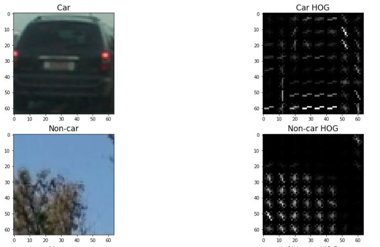
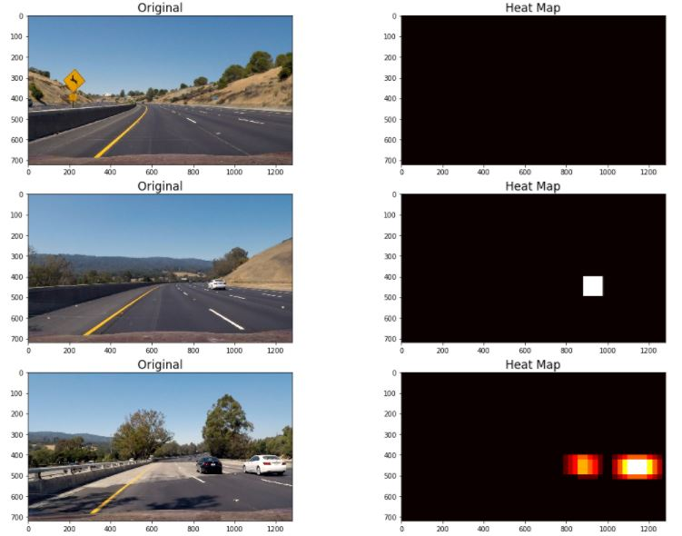
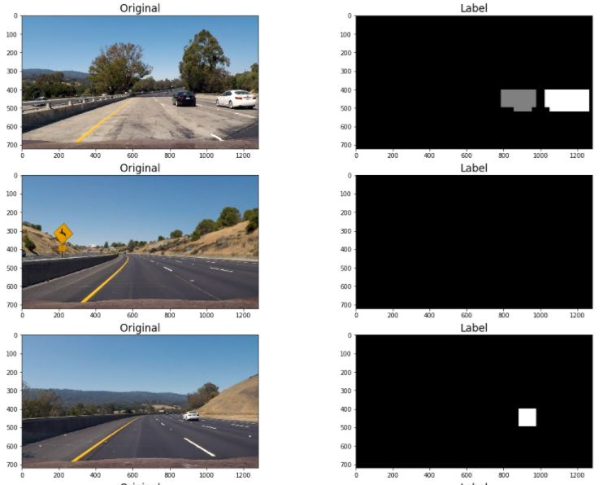
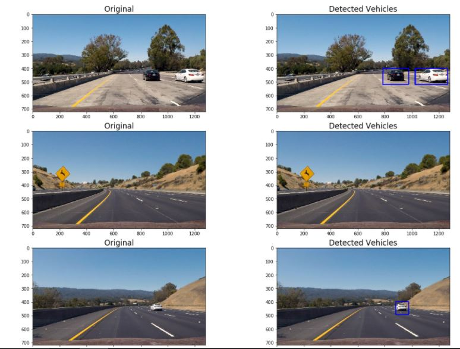

## Udacity SDCND - Term 1, Project 5

### **Vehicle Detection** ###
---


### Writeup / README

#### 1. Provide a Writeup / README that includes all the rubric points and how you addressed each one.

This file *__is__* the Writeup Report.

---
---

### Histogram of Oriented Gradients (HOG)

#### 1. Explain how (and identify where in your code) you extracted HOG features from the training images.

The HOG features are extracted using the Udacity classroom code in the method **get_hog_features()** defined at `Cell 05`. 

The method is called with the following parameters:
* Orientation = 9
* Pixels per cell = (8, 8)
* Cells per block = (2, 2)
* Block Normalization = L2-Hys

---

For processing the training data, the **extract_features()** method defined at `Cell 08` is called. It is responsible for:
1. Converting image to _YCrCb_ color space, `Line 17`.
2. Extracting spatial bin features of the image, `Line 31`.
3. Extracting the color historgram features of the image using **color_hist()** method, ` Line 34`. 
4. Extracting the HOG features for one or all of the channels using the **get_hog_features()** method mentioned above, `Line 38`.

---

Below image compares the HOG features of a car image to a non-car image. This and more examples are in `Cell 35`



#### 2. Explain how you settled on your final choice of HOG parameters.

The parameters for HOG and other features are specified in `Cell 13`.

```python
colorspace = 'YCrCb'
orient = 9
pix_per_cell = 8
cell_per_block = 2
hog_channel = 0
hist_bins = 32
spatial_size = (32, 32)
```

Experimenting with different color spaces, I found that *YUV* and *YCrCb* spaces give the best results. Isolating the Y channel gives slightly better test accuracy and fewer false positives, so I've utilized only the Y channel while extracting the HOG features.

Further, resizing down to (32, 32) still maintains enough information to detect the vehicles correctly. 

Lastly, I have left the *orientation* count at 9 because increasing did not result in any significant increase in accuracy.

The total feature length comes out to be **4932**.

#### 3. Describe how  you trained a classifier

The features were normalized using the **StandardScaler()** at `Cell 14, Line 15`.

The training is done in `Cells 15 - 19`.

I have attempted a GridSearch using both **SVC** and **LinearSVC**. I was able to get a much better model using SVC. The results of the GridSearch can be found at `Cell 16`.

```
The best score is 0.9932 with :

SVC(C=10, cache_size=200, class_weight=None, coef0=0.0,
  decision_function_shape='ovr', degree=3, gamma='auto', kernel='rbf',
  max_iter=-1, probability=False, random_state=None, shrinking=True,
  tol=0.05, verbose=False)
 ```
  
The SVC is initialized and train with these optimum hyper-parameters at `Cell 17` and returns a good test accuracy.
  
  ```
163.63 Seconds to train SVC...
Test Accuracy of SVC =  0.9935
```

---
---

### Sliding Window Search

#### 1. Describe how you implemented a sliding window search. 

Witih a few modifications, I have utilized the **find_cars()** method from the Udacity classroom. It is defined in `Cell 24`. 

This method uses the subsampling approach (as described in the Udacity classroom) to extract HOG features. It makes a prediction on the features and returns the bounding boxes with positive predictions. The subsampling approach provides some performance improvement over a pure sliding window approach.

The window size is 64x64 pixels with a scale of 1.5 (The region of interest is scaled down). Since a constant window size was giving reasonable results, I did not attempt to break down the area into windows with various sizes.

One important change, as highlighted before, is to ignore the 400 pixels on the left of the image. This was done to speed up the video processing since the hardware is not suitable for this task and takes over an hour to generate a project output video. The change was made at the suggestion of our Udacity Session Lead.

#### 2. Show some examples of test images to demonstrate how your pipeline is working. 

The below images provide a simple demonstration of the pipeline. 

**1. Heat Maps**

More examples are at `Cell 37`.



**2. Label Images**

More examples are at `Cell 39`



**3. Detection Boxes**

More examples are at `Cell 29`



---
---

### Video Implementation

#### 1. Provide a link to your final video output.  

The main output video is [here](/test_videos_output/project_video_output.mp4).

The model performs reasonably well. It is not too wobbly (but nor is it perfectly smooth). However, there are no false positives. This was achieved by using a 3-dimensional heatstack, across the last 20 frames (More details in below sections).

#### 2. Describe how (and identify where in your code) you implemented some kind of filter for false positives and some method for combining overlapping bounding boxes.

The main **video_pipeline()** is at `Cell 40`. For the purpose of eliminating false positives, I am using a global **deque** object named _heatstack_. The heatstack, is essentially, a collection of the heatmaps from the past 20 frames.

Note that at no point is *ANY* kind of threshold applied on the heatmaps. A mean is taken over the heatstack and converted to _Int32_. As a result, an area needs to be detected by _at least_ one box per frame (on average) across 20 frames, in order to be drawn on screen.

The heatstack object is first initialized
```python
global heatstack
heatstack = deque(maxlen=20)
```

The heatmap of the current frame is added to the stack.
```python
# Add it to the heatstack
heatstack.append(heatmap)
```

A mean of this stack is then obtained and passed on for labelling.
```python

# Get the mean of the heatstack
meanstack = np.mean(heatstack, axis=0).astype(np.int32)

# Apply labels to detect individual vehicles
labels = label(meanstack)
```
---
---

### Discussion

#### 1. Briefly discuss any problems / issues you faced in your implementation of this project. 

On this project, building the pipeline was not difficult. Two challenging aspects were finding the optimum HOG features and selecting the appropriate model with its hyperparameters. GridSearch greatly helped in this regard.

While there are no false positives, it can be seen that at the very end of the video, the last car is not detected by the model. This could perhaps be improved by scaling the window to different sizes based on its position on the screen.

Further, the bounding box surrounding the car is not perfect and keeps shifting. This can be fixed through some advanced tracking to lock on to a vehicle till it is no longer detected and fixing a minimum bounding box.

Lastly, due to the 3-dimensional heatstack approach, there is a chance of false positives in the initial frames. To avoid this, the stack had to be filled with dummy values (0). This could result in a false negative.

